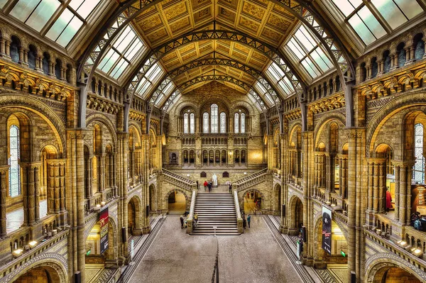
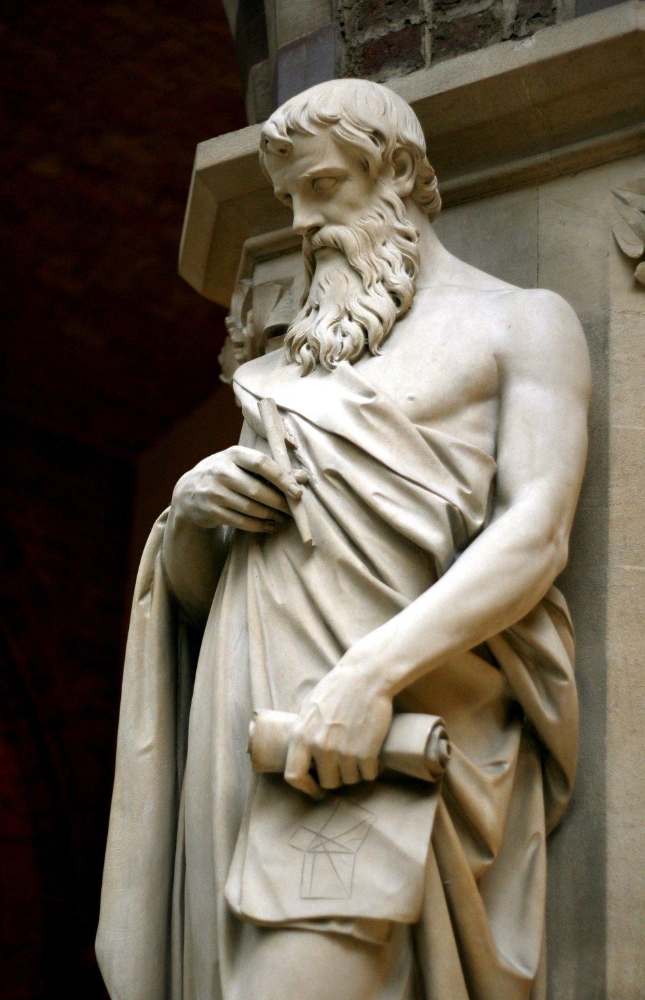

# My favourite piece of academic work

My favourite piece of academic writing is an assignment I wrote for statistics. We were asked to consider an international marketing issue for a company of our choice; I did lots of research on it. I am *extremely* proud as I gained a score of 92% for this subject. 

[Link to carleton's website](https://carleton.ca/)

